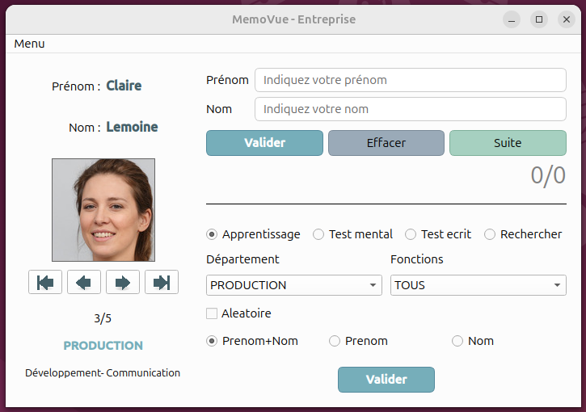

# MémoVue

## Fonction du projet

MémoVue est une application éducative développée en Python avec une interface graphique PySide6.  
Elle permet d’apprendre ou de retrouver les noms et prénoms de personnes à partir d'une base de données SQLite3.

## Fonctionnement

L'interface comporte trois zones. La zone gauche donne des informations sur la personne. La zone en haut à droite permet de répondre aux questions. Et la zone en bas à droite permet d'effectuer les réglages (n'oubliez pas le bouton Valider !)



Du bas vers le haut dans la zone en bas à droite :

1. On sélectionne ce que l'on souhaite :
   - prénom et nom
   - prénom seul
   - nom seul
2. On peut sélectionner un mode aléatoire (dans le désordre).
3. L’application propose plusieurs modes d’utilisation :
   - **Apprentissage** : affichage des personnes et de leurs informations.
   - **Test écrit** : l’utilisateur doit saisir les noms ou prénoms.
   - **Test oral** : affichage d’une photo. L’utilisateur doit chercher mentalement avant de voir la correction.
   - **Recherche** : permet de retrouver un élève à partir d’un nom ou prénom.
4. Les quatre boutons sous l’image permettent de faire défiler les images sélectionnées.

## Vidéo

[Vidéo de MémoVue](https://youtu.be/FgAwiuIiPuc)

## Installation

1. **Installation de Python sous Windows** :  
   Dans la partie Stable Releases :  
   [Installation Python - Windows](https://www.python.org/downloads/windows/)

2. **Cloner le dépôt** :

   ```bash
   git clone https://github.com/GerardLeRest/MemoVue
   cd MemoVue
   ```

3. **Créer un environnement virtuel** :  
   `venv` doit être installé. `mon_env` est le nom de l'environnement Python.

   - Sous Ubuntu :

     ```bash
     python3 -m venv mon_env
     source mon_env/bin/activate
     ```

   - Sous Windows :
     - CTRL + Shift + P
     - Python: Select Interpreter
     - Create Virtual Environment  
     Un dossier `.env` est créé

## Dépendances

Le programme nécessite les bibliothèques suivantes :

- `sqlite3` (intégré à Python3 pour la gestion de la base de données — ne pas installer)
- `PySide6` (bibliothèque graphique à installer)

Pour installer PySide6 :

```bash
pip install pyside6
```

## Données utilisées

Le programme utilise :

- Une base de données SQLite (`eleves.db`, `deputes.db` ou `salaries.db`, à la racine du projet)
- Des images des personnes (dans un dossier `fichiers/photos/`)
- Des fichiers CSV pour l'importation initiale (dossier `fichiers/deputes/`, par exemple)  
  Il y a donc trois organismes indépendants les uns des autres. Il est possible d'ajouter ou modifier un organisme (comme par exemple un club de sport, etc.).

## Lancement

Lancer le programme principal :

```bash
python ChoixOrganisme.pyw
```

## Remarques

- Compatible Python 3.8+
- Testé sous Ubuntu et Windows
- L’application est en cours d’amélioration (v0.51)

## Liens

- Site internet : https://gerardlerest.github.io/memovue/
- Dépôt GitHub : https://github.com/GerardLeRest/MemoVue

## Licence & photos

Ce projet est distribué sous licence GPL-v3.  
© 2025 Gérard LE REST

Les portraits utilisés dans ce projet proviennent de **Generated Photos**  
→ https://generated.photos

Images générées par intelligence artificielle, utilisées dans un cadre pédagogique non commercial.  
Mention requise :  
**“Image by Generated Photos (https://generated.photos), used with permission.”**
